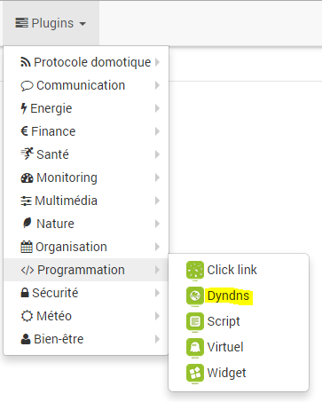

Este complemento permite actualizar un servicio DNS dinámico
(Dyndns, NOIP, duckdns ...)

Configuración del complemento 
=======================

Después de descargar el complemento, solo necesita activarlo,
no hay configuración a este nivel.

Configuración del equipo 
=============================

Se puede acceder a la configuración del equipo Dyndns desde el menú
plugin :

Así es como se ve la página del complemento Dyndns (aquí con 1
equipos) :

> **punta**
>
> Como en muchos lugares de Jeedom, coloca el mouse en el extremo izquierdo
> muestra un menú de acceso rápido (puede, en
> desde tu perfil, siempre déjalo visible).

Una vez que haces clic en uno de ellos, obtienes :

Aquí encontrarás toda la configuración de tu equipo :

-   **apellidobre del equipo de Ambilight** : nombre de su equipo
    Ambilight

-   **Objeto padre** : indica el objeto padre al que pertenece
    equipos,

-   **categoría** : categorías de equipos (puede pertenecer a
    varias categorías),

-   **Activar** : activa su equipo,

-   **visible** : hace que su equipo sea visible en el tablero de instrumentos,

-   **servicio** : El nombre del servicio utilizado (dyndns.org, noip.com)

-   **nombre de host** : apellidobre DNS completo para actualizar (por ejemplo, toto.ddns.net)

-   **nombre del usuario** : nombre de usuario en el servicio en cuestión

-   **Contraseña** : contraseña en el servicio en cuestión

-   **simbólico** : ficha utilizada para duckdns

A continuación encontrará la lista de pedidos. :

-   **apellido** : el nombre que se muestra en el tablero,

-   **visualización** : muestra los datos en el tablero,

-   **prueba** : permite probar el comando

> **nota**
>
> Jeedom verificará la ip externa cada 15 minutos, si tiene
> cambiado, luego se actualizará el DNS

> **importante**
>
> El complemento proporciona un comando para forzar la actualización. Atención a
> no abuses de él porque puedes ser expulsado temporalmente del servicio
> DNS

> **nota**
>
> Si usa OVH, tenga cuidado de que el nombre de usuario esté en el formulario
> midominio.com-identificador mientras el dominio está bien bajo
> formulario mon-dynHost.mmidominio.com
